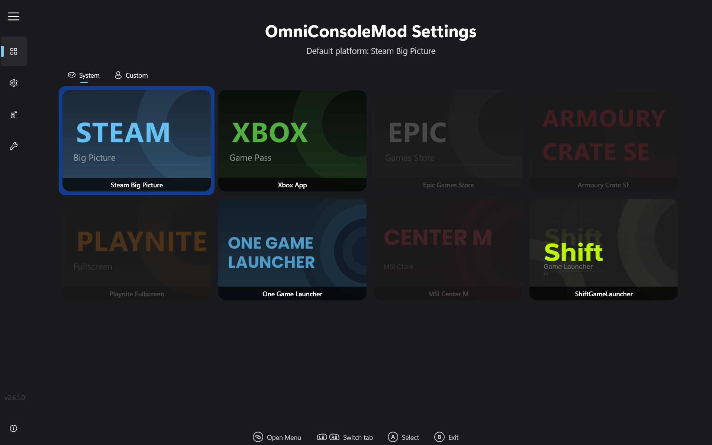
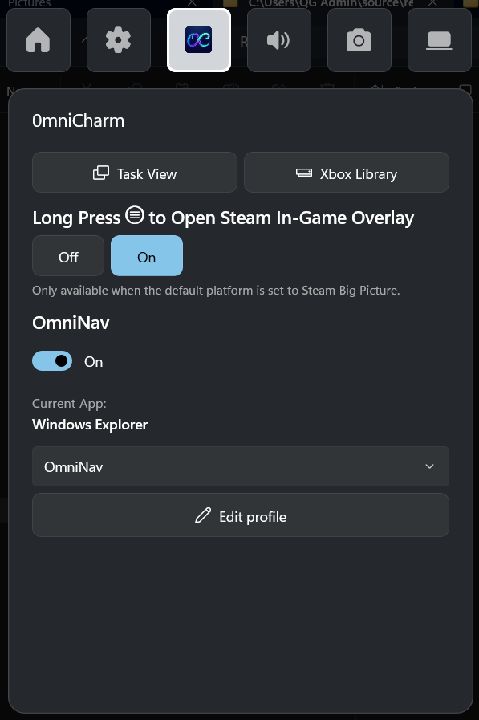
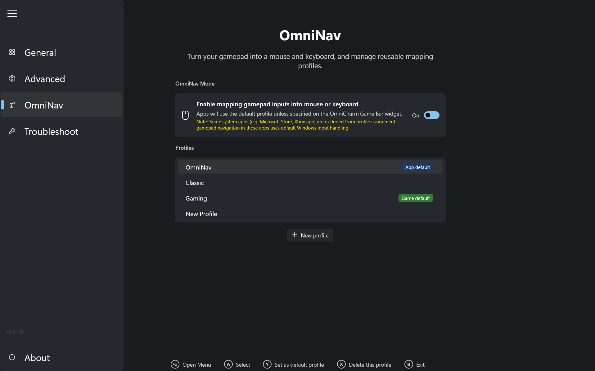
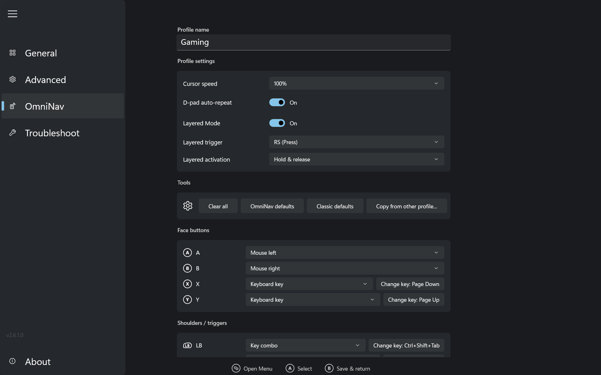
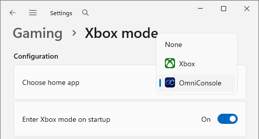

# OmniConsoleMod

> 🌐 [English](README.md) | [繁體中文](README.zh-TW.md) | **Bahasa Indonesia**

<p align="center">

</p>

<p align="center">
  
</p>

<p align="center">
<a href="https://github.com/red-Geck0/OmniConsoleMod/releases/latest"></a>
<a href="https://github.com/red-Geck0/OmniConsoleMod/releases"></a>
<a href="#"></a>
<a href="https://github.com/red-Geck0/OmniConsoleMod/blob/main/LICENSE"></a>
</p>

## 💡 Apa itu OmniConsoleMod?

OmniConsoleMod dapat menjadi Home shell untuk Xbox Mode (FSE) Windows 11 di PC dan handheld (ROG Ally, Legion Go, dll) menggantikan Xbox App bawaan Windows, lengkap dengan widget OmniCharm Game Bar, sistem profile mapping gamepad OmniNav, dan shortcut Steam. Tiap kali Xbox Mode (FSE) aktif, OmniConsoleMod nge-launch platform gaming yang udah kamu set. Platform apa pun bisa jadi Home Xbox Mode (FSE) kamu — Steam, Xbox, Epic, Armoury Crate SE, Playnite, One Game Launcher, MSI Center M, Shift Game Launcher, atau aplikasi apa pun yang kamu tambahin.

- **Saat boot**: Kalau "Enter Xbox mode (FSE) on startup" diaktifkan, platform gaming tersebut otomatis ke-launch saat boot.
- **Saat Xbox mode aktif**: Tekan **tombol Xbox** untuk buka Game Bar, lalu pilih tab Home, pilih **"Home"** untuk nge-launch platform gaming kamu, atau **"Library"** buat buka OmniConsoleMod Settings.

---

## ✨ Fitur

- **Auto-launch platform** – Platform gaming yang kamu set otomatis ke-launch tiap Xbox Mode (FSE) aktif.
- **Auto masuk Xbox Mode (FSE)** – Pas kamu buka OmniConsoleMod di luar Xbox Mode (FSE) (misalnya dari Start Menu), dia otomatis memunculkan dialog masuk Xbox Mode (FSE).
- **Dukungan multi-platform** – Built-in support buat **Steam Big Picture**, **Xbox App**, **Epic Games Store**, **Armoury Crate SE**, **Playnite Fullscreen**, **One Game Launcher**, **MSI Center M**, dan **Shift Game Launcher**, plus dukungan Custom platform (eksperimental).
- **Integrasi Game Bar** – Tombol **"Home"** di Game Bar nge-launch platform gaming kamu; **"Library"** buka OmniConsoleMod Settings.
- **Halaman Troubleshoot** – Halaman khusus buat recovery Xbox Mode (FSE): nge-restart Game Bar buat benerin masalah kayak dialog "Restart for better performance" yang nggak muncul, lalu masuk Xbox Mode (FSE).
- **UI gamepad-first** – App-nya bisa dinavigasi sepenuhnya pakai gamepad.
- **OmniNav — Profile & Mapping Gamepad Terpadu** – Map input gamepad ke aksi keyboard dan mouse lewat toggle switch (**On** / **Off**). Dikelola lewat profile mapping bernama yang reusable, jadi binding, cursor speed, dan setelan navigasi bisa diatur per-profile.
- **Default Profiles** – Datang dengan profile built-in: **OmniNav** (read-only), **Classic** (read-only), **Gaming** (editable, layered mode aktif), dan **None** (mematikan mapping sepenuhnya biar game pakai gamepad native).
- **Layered Mode** – Aktifin/matiin binding sekunder secara on-the-fly di profile custom (kayak profile **Gaming** default) dengan nahan tombol trigger (misalnya Right Stick `RS`) atau double-tap buat toggle.
- **Aksi Touch Keyboard** – Bisa map sebuah tombol buat nge-launch virtual keyboard Windows (Touch Keyboard) lewat TabTip COM atau OSK.
- **Widget OmniCharm** – Widget Game Bar buat akses cepat saat in-game. Buka **Task View**, **Xbox Library**, atau **Steam Overlay** sekali tap; toggle **OmniNav (Gamepad Mouse Mode)**, assign/ganti profile mapping buat app yang aktif secara on-the-fly, dan toggle **Steam In-Game Overlay** (long-press ☰).
- **Integrasi Xbox Mode (FSE) native** – Terdaftar sebagai Home App Xbox Mode (FSE) Windows 11 lewat API resmi.
- **Update in-app** – Otomatis cek release GitHub terbaru, dengan download dan install langsung dari halaman Advanced settings.

---

## ⚔️ OmniNav (OmniConsoleMod) vs Nekomata (OmniConsole Upstream)

| Dimensi Perbandingan | Nekomata (OmniConsole Upstream) | OmniNav (OmniConsoleMod) |
|---|---|---|
| **Model Arsitektur** | Diikat langsung per-aplikasi (per-app mapping). | **Model Profile Terpadu**: Mapping dikelola sebagai Named Profile yang reusable, lalu di-assign ke app. |
| **Gamepad Mouse Mode** | Setelan global dengan 3 mode: Off, Auto, Force On. Layout (OmniNav/Classic) dan cursor speed di-set global lewat INI. | Disederhanakan jadi satu switch global **On / Off**. Layout, cursor speed, dan sensitivity diatur per-profile. |
| **Input Blocker** | Punya **Input Blocker** (memblok input gamepad asli biar nggak double input di game). | Nggak ada input blocker ketat. Didesain sebagai **helper** buat trigger shortcut/mod saat main, atau navigasi app non-game dengan gampang. |
| **Sifat Layered Mode** | Nggak ada. Cuma dukung satu layer mapping statis. | **Ada**: Berfungsi buat aktifin/matiin mapping tombol secara on-the-fly dengan nahan atau double-tap tombol trigger tertentu (misalnya `RS`). |
| **Deteksi Game & Fullscreen** | Mengandalkan konfigurasi per-app statis. | Punya **Deteksi Game & Fullscreen** buat otomatis nerapin profile 'Game Default' (misalnya profile Gaming) atau 'App Default' ke app/game baru. |
| **Aksi Tambahan** | Mapping terbatas ke tombol keyboard/mouse standar. | Dukung aksi sistem kayak nge-launch **Touch Keyboard** lewat TabTip COM atau OSK. |
| **Integrasi Widget** | Toggle layout global dan konfigurasi per-app di dialog terpisah. | Assign profile instan lewat dropdown buat app yang aktif, plus tombol shortcut buat buka editor. |

---

## 📖 Mini Guide: Pakai OmniNav & Profiles

### 1. Toggle OmniNav On/Off
Buka **Widget OmniCharm** di Xbox Game Bar (Win + G atau tombol Xbox) dan pakai toggle switch utama buat nyalain OmniNav **On** atau **Off**.

### 2. Assign App Cepat
Saat lagi pakai aplikasi apa pun:
1. Buka **Widget OmniCharm**.
2. Di bagian **Foreground App**, kamu bakal lihat nama app yang aktif.
3. Pilih profile dari dropdown (misalnya pilih `Gaming`, `OmniNav`, atau `None` untuk men-disable fitur button mapping).
4. Profile tsb otomatis di-assign ke game/app dan diterapin tiap app itu lagi fokus.

### 3. Memahami Default Profiles
OmniConsoleMod pakai deteksi game dan fullscreen buat nerapin profile fallback:
- **App Default**: Diterapin ke app windowed biasa yang nggak punya profile khusus. (Default: `OmniNav`).
- **Game Default**: Otomatis diterapin ke game atau aplikasi fullscreen yang kedeteksi dan nggak punya profile khusus. (Default: `Gaming`).
- Kamu bisa ganti default ini di **OmniConsoleMod Settings -> OmniNav -> Profiles**.

### 4. Pakai Layered Mode
Profile **Gaming** punya **Layered Mode** aktif secara default pakai Right Stick (`RS`) sebagai trigger.
- **Aksi**: A. Tahan `RS` (1.6 detik) mengaktifkan Layered Mode, lepas `RS` utk matikan; B. Double-tap `RS` untuk mengaktifkan Layered Mode, double-tap lagi untuk matikan. 
- Ini berguna buat map shortcut sistem cepat ke tombol controller saat main game, lalu matiin lagi buat balik ke kontrol normal.
- Contoh use case Layered Mode : buka/tutup OSD (RTSS, NVIDIA, Steam Overlay, dll), buka/aktifkan game mod (Lossless Scaling,Optiscaler,SpecialK, dll), munculin Virtual Keyboard untuk mengisi inputan nama karakter game, start/stop/toggle-fullscreen di console emulator. 
- Catatan : profil 'Gaming' di sini hanya sekedar profil standar yg Layered Modenya di-set aktif dan diberi nama 'Gaming'. Jadi kamu gak harus pakai profile ini untuk setiap game

### 5. Bikin & Edit Profiles
1. Buka **OmniConsoleMod Settings** dari Start Menu.
2. Masuk ke tab **Gamepad Profiles**.
3. Pilih profile yang udah ada buat edit setting dan key binding-nya, tekan **Y** utk set as default. tekan **X** untuk bikin profile custom.
4. Tekan **Copy from...** buat menyalin konfigurasi dari profile read-only seperti `OmniNav` atau `Classic`.

---

## ⚙️ Prerequisites

OmniConsoleMod butuh **Full Handheld edition** dari Xbox Mode (FSE). Microsoft lagi bertahap nge-roll out Limited PC edition ke PC biasa — pakai [Xbox Full Screen Experience Tool (XFSET)](https://github.com/8bit2qubit/XboxFullScreenExperienceTool) buat pindah ke Full Handheld edition.

- **Desktop, Laptop, Tablet & Handheld tanpa Full Handheld edition**: Jalankan XFSET dulu.
- **Native Handheld Devices** (misalnya seri ROG Ally, Legion Go): Udah di Full Handheld edition — install OmniConsoleMod langsung.
- **Wajib Controller Xbox**: Game Bar, Xbox Mode (FSE), dan semua fitur gamepad butuh controller Xbox-compatible (XInput) dengan tombol Xbox.

---

## 🚀 Quick Start

### 1. Install OmniConsoleMod

Download release terbaru dari [**Releases Page**](https://github.com/red-Geck0/OmniConsoleMod/releases/latest).

**Opsi A: Install.bat (Disarankan)**

1.  Extract file `OmniConsoleMod_*_x64.zip` dan jalankan `Install.bat`. Dia bakal ngaktifin Developer Mode, install certificate, install framework dependencies yang kurang, dan install kedua paket MSIX otomatis.

**Opsi B: Manual Install**

1.  **[Penting]** Masuk ke **Windows Settings → System → Advanced** dan aktifin **Developer Mode**.
2.  **[Penting]** Double-click file `.cer` → klik **Install Certificate** → Store Location: **Local Machine** → **Place all certificates in the following store** → Browse → pilih **Trusted People** → Finish.
3.  *(Opsional — cuma perlu di sistem fresh/offline; sistem online ambil ini otomatis)* Double-click tiap file di dalam `Dependencies\` buat install framework package bawaan (skip yang udah ke-install versi sama atau lebih baru).
4.  Double-click `OmniConsoleMod_*_x64.msix` buat install app utama.
5.  Double-click `OmniConsoleMod.OmniCharm_*_x64-widget.msix` buat install widget OmniCharm.

### 2. Atur Default Platform Kamu

OmniConsoleMod bakal nampilin UI Settings pas **first launch** atau **setelah app update**. Kamu juga bisa buka manual kapan aja dari Start Menu:

1.  Buka **"OmniConsoleMod Settings"** dari Start Menu (All Apps).
2.  Pilih platform gaming favorit kamu dari card grid pakai **mouse**, **touch**, atau **controller Xbox** (**D-Pad/Left Stick** buat navigasi ke empat arah, **A** buat konfirmasi):
    - **Steam Big Picture**
    - **Xbox App**
    - **Epic Games Store**
    - **Armoury Crate SE**
    - **Playnite Fullscreen**
    - **One Game Launcher**
    - **MSI Center M**
    - **Shift Game Launcher**

    Pilihan kamu kesimpan otomatis. Tekan **B** di controller atau klik/tekan **Exit** buat selesai.

### 3. [Penting] Set sebagai Xbox Mode (FSE) Home App

<p>
  
</p>

1.  Masuk ke **Windows Settings → Gaming → Xbox mode (FSE)**.
2.  Set "Choose home app" ke **OmniConsoleMod**.
3.  Aktifin **"Enter Xbox mode (FSE) on startup"**.

### 4. Selesai!

Platform gaming kamu sekarang ke-launch lewat salah satu entry point ini:

- **Game Bar**: Tekan **tombol Xbox**, lalu pilih **"Home"** buat nge-launch platform gaming kamu, atau **"Library"** buat buka OmniConsoleMod Settings.
- **Boot**: Aktifin **"Enter Xbox mode (FSE) on startup"** buat auto-launch saat boot.
- **Start Menu**: Launch OmniConsoleMod langsung buat otomatis ngaktifin Xbox Mode (FSE).

---

## 🔄 Cara Revert

> ⚠️ **Ganti setelan Xbox Mode (FSE) Home App _sebelum_ uninstall OmniConsoleMod.** Kalau OmniConsoleMod dihapus pas masih ke-set sebagai Xbox Mode (FSE) Home App, **Task View Windows bakal berhenti jalan** di sebagian build. Ini bug Windows-nya sendiri.

1. Masuk ke **Windows Settings → Gaming → Xbox mode (FSE)**.
2. Set "Choose home app" ke **Xbox** atau **None**.
3. Klik-kanan **OmniConsoleMod** di Start Menu lalu pilih **Uninstall**, atau masuk ke **Windows Settings → Apps → Installed apps** dan uninstall.
4. Masuk ke **Windows Settings → Apps → Installed apps** dan uninstall **OmniConsoleMod OmniCharm** (widget-nya nggak muncul di Start Menu).

---

## 🛠️ Troubleshooting

Kalau kamu kena masalah gara-gara bug Windows, kayak Game Bar gagal kebuka atau dialog "Restart for better performance" nggak muncul pas masuk Xbox Mode (FSE):

1. Buka **OmniConsoleMod Settings** dari Start Menu.
2. Navigasi ke tab **Troubleshoot** lewat menu kiri.
3. Klik tombol **"Run"** di sebelah **"Restart Game Bar & Enter Xbox Mode (FSE)"**. Ini nge-restart Game Bar dan masuk Xbox Mode (FSE); begitu Game Bar ke-restart, dialog-nya muncul seperti seharusnya.

---

## 💻 Tech Stack


- **Primary Stack**: C# & .NET 8, C++
- **UI Framework**: WinUI 3
- **Packaging**: MSIX

---

## 🛠️ Local Development

1.  **Clone Repository-nya**

    ```bash
    git clone https://github.com/red-Geck0/OmniConsoleMod.git
    cd OmniConsole
    ```

2.  **Buka di Visual Studio**

    Buka `OmniConsole.sln` pakai Visual Studio 2026 (18.0+). Pastikan workload **WinUI application development** udah ke-install.

3.  **Run buat Development**

    Set build configuration ke `Debug`, pilih platform kamu (`x64`), dan tekan `F5`.

---

## 📄 Lisensi

OmniConsole dilisensikan di bawah [PolyForm Noncommercial License 1.0.0](https://github.com/red-Geck0/OmniConsoleMod/blob/main/LICENSE).

Kamu bebas pakai, modif, dan redistribute OmniConsole buat keperluan personal dan nonprofit di bawah lisensi yang sama. Buat term lengkapnya, lihat [PolyForm Noncommercial License 1.0.0 resmi](https://polyformproject.org/licenses/noncommercial/1.0.0).
