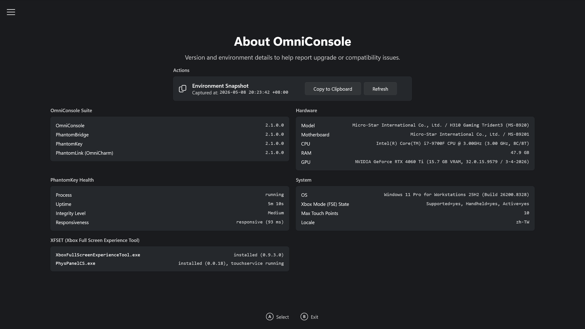

# OmniConsole

> 🌐 **English** | [繁體中文](README.zh-TW.md)

<p align="center">

</p>

<p align="center">
  
</p>

<p align="center">
<a href="https://github.com/8bit2qubit/OmniConsole/releases/latest"></a>
<a href="https://github.com/8bit2qubit/OmniConsole/releases"></a>
<a href="#"></a>
<a href="https://github.com/8bit2qubit/OmniConsole/blob/main/LICENSE"></a>
</p>

A custom **WinUI 3 gaming platform launcher** designed to replace the default Windows 11 **Xbox Mode (FSE) Home shell**, providing a seamless, console-like boot experience for gaming PCs and handhelds.

---

## 🔀 Fork Information

> 📌 **This is an enhanced fork** of the original [OmniConsole](https://github.com/8bit2qubit/OmniConsole) by [8bit2qubit](https://github.com/8bit2qubit).

**Maintained by**: [red-Geck0](https://github.com/red-Geck0)  
**Enhancement Focus**: Improved gamepad controller navigation, virtual keyboard integration, and settings UI refinement.

### Recent Enhancements (May 2024 – May 2026)
- ✅ **Gamepad Navigation Fixes**: SelectorBar positioning, RadioButtons D-Pad control, ComboBox scroll visibility
- ✅ **Right-Stick Scrolling**: Smooth scrolling in dropdowns and settings panels at 30 FPS
- ✅ **Virtual Keyboard Support**: Windows 11 Touch Keyboard (COM) and On-Screen Keyboard (osk.exe) as special actions
- ✅ **Layered Mode Feature**: Per-button custom mappings with hold-to-activate triggers and audio feedback
- ✅ **Mouse Mode Settings Page**: Dedicated UI for gamepad-to-mouse configuration with dual layout support
- ✅ **Mouse Mode Whitelist/Blacklist**: User-editable app lists for fine-grained Mouse Mode control

For a complete list of contributions, see [**CONTRIBUTORS.md**](CONTRIBUTORS.md).

---


## 💡 What is OmniConsole?

OmniConsole serves as your Windows 11 Xbox Mode (FSE) Home shell on PCs and handhelds (ROG Xbox Ally X, etc.), with an OmniCharm Game Bar widget, Mouse Mode, and Steam shortcuts so everything stays on the gamepad. Whenever Xbox Mode (FSE) activates, OmniConsole launches your configured gaming platform. Any platform can be your Xbox Mode (FSE) Home — Steam, Xbox, Epic, Armoury Crate SE, Playnite, or anything you add.

- **On boot**: With "Enter Xbox mode (FSE) on startup" enabled, your gaming platform launches automatically at boot.
- **During use**: Press the **Xbox button**, then select **"Home"** in Game Bar to launch your gaming platform, or **"Library"** to open OmniConsole Settings.

---

## ✨ Features

- **Automatic platform launch** – Your configured gaming platform launches automatically whenever Xbox Mode (FSE) activates.
- **Automatic Xbox Mode (FSE) entry** – When you launch OmniConsole outside Xbox Mode (FSE) (e.g., from the Start Menu), it automatically triggers the Xbox Mode (FSE) entry dialog.
- **Multi-platform support** – Built-in support for **Steam Big Picture**, **Xbox App**, **Epic Games Store**, **Armoury Crate SE**, and **Playnite Fullscreen**.
- **Custom platform support (experimental)** – Add your own platforms via Protocol URI, executable path, or Packaged App (MSIX / APPX), with an optional card cover image. Launch arguments are available when using the executable path type.
- **Platform import & export** – Share custom platform configurations as JSON. Right-click or long-press a card to export; use the Import button to import shared configurations.
- **Gamepad-compatible file picker** – A custom-built file picker that replaces the system FileOpenPicker (which does not support gamepad input), letting you browse for executables and cover images with a controller. A "Browse (Windows)" button is also available for users who prefer the system file picker.
- **Card-grid settings UI** – Large icon cards designed for large-screen and handheld use, operable with **mouse**, **touch**, or **Xbox controller**.
- **Game Bar integration** – Game Bar's **"Home"** button launches your gaming platform; **"Library"** opens OmniConsole Settings.
- **Troubleshoot page** – A dedicated page for emergency Xbox Mode (FSE) recovery: terminates Game Bar and enters Xbox Mode (FSE) directly, bypassing the entry confirmation dialog.
- **Environment snapshot** – An "About" page that captures your system, hardware, and OmniConsole health status, with one-click copy as a Markdown report for easy bug reporting.
- **Gamepad support** – Navigate with **D-Pad** or **Left Stick**; **A** to confirm, **B** to exit, **LB/RB** to switch category tabs, **Y** to add a custom platform, **X** to edit, and **Menu (☰)** to set the focused platform as default and launch it immediately (when running inside Xbox Mode (FSE)).
- **Gamepad Mouse Mode** – Use your gamepad as a mouse and keyboard. Three modes: **Off**, **Auto** (browsers, File Explorer, Steam, Epic Games Store), and **Force On** (all apps except an exclusion list). Cursor speed is adjustable, with two controller layouts to choose from: **OmniNav** and **Classic**.
- **OmniCharm widget** – A Game Bar widget for in-game quick access. Open **Task View**, the **Xbox Library**, or the **Steam Overlay** in one tap; toggle **Gamepad Mouse Mode**, controller layout, and cursor speed; long-press ☰ to open the **Steam In-Game Overlay**.
- **Gamepad Steam shortcuts** – The gamepad **⧉** button controls Steam Big Picture shortcuts: short press opens the **Steam Menu**, long press opens the **Quick Access Menu**. Long press **☰** in-game to open the **Steam In-Game Overlay**.
- **Dedicated Settings entry** – A separate "**OmniConsole Settings**" entry in All Apps lets you change your default platform anytime.
- **Native Xbox Mode (FSE) integration** – Registered as a Windows 11 Xbox Mode (FSE) Home App through the official API.
- **In-app updates** – Automatic checks for the latest GitHub releases, with download and install built into the Advanced settings page.
- **Multilingual UI** – English, Traditional Chinese (繁體中文), and Simplified Chinese (简体中文).

---

## ⚙️ Prerequisites

OmniConsole requires the **Full Handheld edition** of Xbox Mode (FSE). Microsoft is gradually rolling out a Limited PC edition to regular PCs — use [Xbox Full Screen Experience Tool (XFSET)](https://github.com/8bit2qubit/XboxFullScreenExperienceTool) to switch to the Full Handheld edition.

- **Desktops, Laptops, Tablets & Handhelds without the Full Handheld edition**: Run XFSET first.
- **Native handheld devices** (e.g., ROG Xbox Ally series): Already on the Full Handheld edition — install OmniConsole directly.
- **Xbox Controller Required**: Game Bar, Xbox Mode (FSE), and all gamepad features require an Xbox-compatible (XInput) controller with an Xbox button.

---

## 🚀 Quick Start

### 1. Install OmniConsole

Download the latest release from the [**Releases Page**](https://github.com/8bit2qubit/OmniConsole/releases/latest).

**Option A: Install.bat (Recommended)**

1.  Extract the `OmniConsole_*_x64.zip` file and run `Install.bat`. It will enable Developer Mode, install the certificate, install any missing framework dependencies, and install both MSIX packages automatically.

**Option B: Manual Install**

1.  **[Critical]** Go to **Windows Settings → System → Advanced** and enable **Developer Mode**.
2.  **[Critical]** Double-click the `.cer` file → click **Install Certificate** → Store Location: **Local Machine** → **Place all certificates in the following store** → Browse → select **Trusted People** → Finish.
3.  *(Optional — only needed on fresh/offline systems; online systems fetch these automatically)* Double-click each file inside `Dependencies\` to install the bundled framework packages (skip any that report an equal or newer version already installed).
4.  Double-click `OmniConsole_*_x64.msix` to install the main app.
5.  Double-click `OmniConsole.PhantomLink_*_x64-widget.msix` to install the OmniCharm widget.

### 2. Configure Your Default Platform

OmniConsole will present the Settings UI on **first launch** or **after app updates**. You can also open it manually anytime from the Start Menu:

1.  Open **"OmniConsole Settings"** from the Start Menu (All Apps).
2.  Select your preferred gaming platform from the card grid using a **mouse**, **touch**, or **Xbox controller** (**D-Pad/Left Stick** to navigate in all four directions, **A** to confirm):
    - **Steam Big Picture**
    - **Xbox App**
    - **Epic Games Store**
    - **Armoury Crate SE**
    - **Playnite Fullscreen**

    Your selection is saved automatically. Press **B** on your controller or click/press **Exit** to finish.

### 3. [Critical] Set as Xbox Mode (FSE) Home App

<p>
  
</p>

1.  Go to **Windows Settings → Gaming → Xbox mode (FSE)**.
2.  Set "Choose home app" to **OmniConsole**.
3.  Enable **"Enter Xbox mode (FSE) on startup"**.

### 4. Done!

Your gaming platform now launches via any of these entry points:

- **Game Bar**: Press the **Xbox button**, then select **"Home"** to launch your gaming platform, or **"Library"** to open OmniConsole Settings.
- **Boot**: Enable **"Enter Xbox mode (FSE) on startup"** for automatic launch at boot.
- **Start Menu**: Launch OmniConsole directly to automatically activate Xbox Mode (FSE).

---

## 🔄 How to Revert

> ⚠️ **Change the Xbox Mode (FSE) Home App setting _before_ uninstalling OmniConsole.** If OmniConsole is removed while it is still set as the Xbox Mode (FSE) Home App, Windows **Task View will stop working** on some builds. This is a bug in Windows itself.

1. Go to **Windows Settings → Gaming → Xbox mode (FSE)**.
2. Set "Choose home app" to **Xbox** or **None**.
3. Right-click **OmniConsole** in the Start Menu and select **Uninstall**, or go to **Windows Settings → Apps → Installed apps** to uninstall it.
4. Go to **Windows Settings → Apps → Installed apps** and uninstall **OmniCharm** (the widget does not appear in the Start Menu).

---

## 🛠️ Troubleshooting

If you experience an issue where the Windows Xbox Mode (FSE) entry dialog ("Restart for better performance") fails to appear due to a Windows bug:

1. Open **OmniConsole Settings** from the Start Menu.
2. Navigate to the **Troubleshoot** tab using the left menu.
3. Click the **"Run"** button next to **"Terminate Game Bar & Enter Xbox Mode (FSE)"**. This will force-close Game Bar and enter Xbox Mode (FSE) directly, bypassing the entry confirmation dialog.

---

## 💻 Tech Stack

- **Primary Stack**: C# & .NET 8, C++
- **UI Framework**: WinUI 3
- **Packaging**: MSIX

---

## 🛠️ Local Development

1.  **Clone the Repository**

    Clone the **fork** (this enhanced version):
    ```bash
    git clone https://github.com/red-Geck0/OmniConsoleMod.git
    cd OmniConsoleMod
    ```

    Or clone the **original** project:
    ```bash
    git clone https://github.com/8bit2qubit/OmniConsole.git
    cd OmniConsole
    ```

2.  **Open in Visual Studio**

    Open `OmniConsole.sln` with Visual Studio 2026 (18.0+). Ensure the **WinUI application development** workload is installed.

3.  **Run for Development**

    Set the build configuration to `Debug`, select your platform (`x64`), and press `F5`.

---

## 🌟 Star History

<a href="https://star-history.com/#8bit2qubit/OmniConsole&Date">
  <picture>
    <source media="(prefers-color-scheme: dark)" srcset="https://api.star-history.com/svg?repos=8bit2qubit/OmniConsole&type=Date&theme=dark" />
    <source media="(prefers-color-scheme: light)" srcset="https://api.star-history.com/svg?repos=8bit2qubit/OmniConsole&type=Date" />
    
  </picture>
</a>

---

## 📄 License

This project is licensed under the [GNU General Public License v3.0 (GPL-3.0)](https://github.com/8bit2qubit/OmniConsole/blob/main/LICENSE).

You are free to use, modify, and distribute this software, but any derivative works must also be distributed under the **same GPL-3.0 license and provide the complete source code**. For more details, see the [official GPL-3.0 terms](https://www.gnu.org/licenses/gpl-3.0.html).
