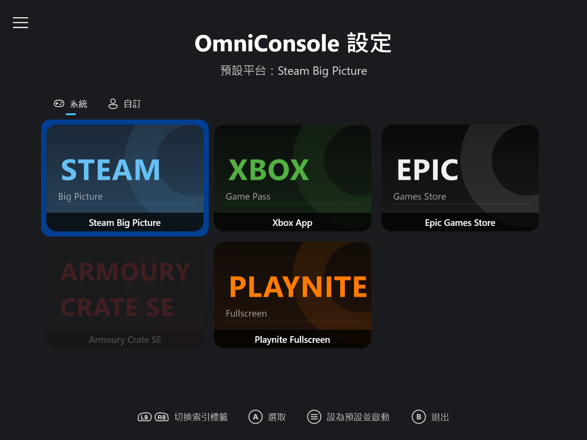
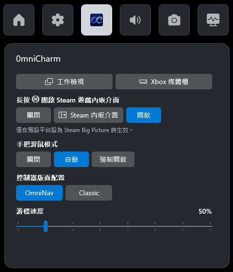
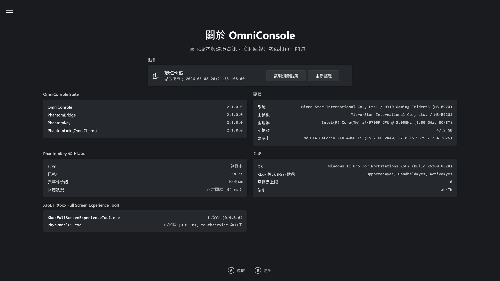
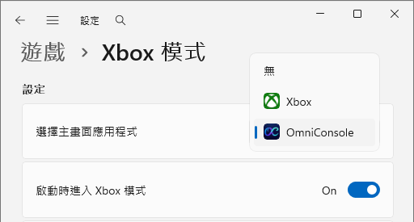

# OmniConsole

> 🌐 [English](README.md) | **繁體中文**

<p align="center">

</p>

<p align="center">
  
</p>

<p align="center">
<a href="https://github.com/8bit2qubit/OmniConsole/releases/latest"></a>
<a href="https://github.com/8bit2qubit/OmniConsole/releases"></a>
<a href="#"></a>
<a href="https://github.com/8bit2qubit/OmniConsole/blob/main/LICENSE"></a>
</p>

## 💡 什麼是 OmniConsole？

OmniConsole 在 PC 與掌機（ROG Xbox Ally X 等）上作為你的 Windows 11 Xbox 模式 (FSE) 首頁殼層，並提供 OmniCharm Game Bar 小工具、滑鼠模式與 Steam 快捷鍵，讓一切操作都不離手把。只要觸發 Xbox 模式 (FSE)，OmniConsole 就會自動啟動你設定的遊戲平台。任何平台都能當你的 Xbox 模式 (FSE) 首頁 — Steam、Xbox、Epic、Armoury Crate SE、Playnite，或你自行新增的平台。

- **開機時**：啟用「啟動時進入 Xbox 模式 (FSE)」後，開機即自動啟動你設定的遊戲平台。
- **使用中**：按下 **Xbox 鍵**，點選 Game Bar 的「**首頁**」啟動遊戲平台，或點選「**媒體櫃**」開啟 OmniConsole 設定。

---

## ✨ 功能特色

- **自動平台啟動** – Xbox 模式 (FSE) 啟用時，OmniConsole 自動啟動你設定的遊戲平台。
- **自動進入 Xbox 模式 (FSE)** – 在 Xbox 模式 (FSE) 之外啟動（例如從開始功能表）時，OmniConsole 會自動觸發 Xbox 模式 (FSE) 進入對話方塊。
- **多平台支援** – 內建支援 **Steam Big Picture**、**Xbox App**、**Epic Games Store**、**Armoury Crate SE** 與 **Playnite Fullscreen**。
- **自訂平台支援（實驗性功能）** – 透過 Protocol URI、執行檔路徑或封裝套件 (MSIX / APPX) 新增自訂平台，可選填卡片封面圖。啟動參數僅在使用執行檔路徑類型時可用。
- **平台匯入與匯出** – 以 JSON 格式分享自訂平台配置。對卡片按右鍵或長按即可匯出；透過匯入按鈕可匯入他人分享的配置。
- **支援手把操作的檔案選擇器** – 自製檔案選擇器，取代不支援手把的系統 FileOpenPicker，可透過控制器瀏覽執行檔與封面圖片。同時提供「瀏覽 (Windows)」按鈕，供偏好系統檔案選擇器的使用者選用。
- **卡片網格設定介面** – 大圖示卡片版型，適合大螢幕與掌機使用，可透過**滑鼠**、**觸控**或 **Xbox 手把**操作。
- **Game Bar 整合** – Game Bar 的「**首頁**」按鈕啟動遊戲平台；「**媒體櫃**」開啟 OmniConsole 設定。
- **疑難排解頁面** – Xbox 模式 (FSE) 緊急救援專屬頁面：結束 Game Bar 並繞過進入確認對話方塊，直接進入 Xbox 模式 (FSE)。
- **環境快照** – 「關於」頁面擷取系統、硬體與 OmniConsole 健康狀態，並支援一鍵複製為 Markdown 格式，方便回報問題。
- **手把支援** – 以**方向鍵**或**左搖桿**導覽；**A 鍵**確認、**B 鍵**退出、**LB/RB** 切換分類索引標籤、**Y 鍵**新增自訂平台、**X 鍵**編輯，**Menu（☰）鍵**將聚焦平台設為預設並立即啟動（僅在 OmniConsole 於 Xbox 模式 (FSE) 中執行時可用）。
- **手把滑鼠模式** – 將手把當作滑鼠與鍵盤使用。三種模式：**關閉**、**自動**（瀏覽器、檔案總管、Steam、Epic Games Store）與**強制開啟**（所有應用程式，排除清單除外）。游標速度可調，並提供兩種控制器版面配置：**OmniNav** 與 **Classic**。
- **OmniCharm 小工具** – 遊戲中快速存取的 Game Bar 小工具：一鍵開啟**工作檢視**、**Xbox 媒體櫃**或 **Steam 遊戲內嵌介面**；切換**手把滑鼠模式**、控制器版面、游標速度；長按 ☰ 開啟 **Steam 遊戲內嵌介面**。
- **手把 Steam 快捷鍵** – 手把 **⧉** 按鍵對應 Steam Big Picture 模式快捷：短按開啟 **Steam 選單**，長按喚出**快速存取選單**。在遊戲中長按 **☰** 可開啟 **Steam 遊戲內嵌介面**。
- **專屬設定入口** – 「所有應用程式」中獨立的「**OmniConsole 設定**」項目，隨時可更改預設平台。
- **原生 Xbox 模式 (FSE) 整合** – 透過 Windows 11 Xbox 模式 (FSE) 官方 API 註冊為主畫面應用程式。
- **內建應用程式更新** – 自動檢查 GitHub 最新版本，可在「進階」設定頁面中直接下載與安裝。
- **多語介面** – 英文、繁體中文與簡體中文。

---

## ⚙️ 前置條件

OmniConsole 需要**完整掌機版**的 Xbox 模式 (FSE)。Microsoft 正逐步將受限 PC 版推送至一般 PC，請使用 [Xbox Full Screen Experience Tool (XFSET)](https://github.com/8bit2qubit/XboxFullScreenExperienceTool) 切換至完整掌機版。

- **桌機、筆電、平板及未取得完整掌機版的掌機**：請先執行 XFSET。
- **原生掌機裝置**（如 ROG Xbox Ally 系列）：原廠即為完整掌機版，可直接安裝 OmniConsole。
- **需要 Xbox 手把**：Game Bar、Xbox 模式 (FSE) 以及所有手把功能皆需使用具備 Xbox 按鈕的 XInput 相容控制器。

---

## 🚀 快速入門

### 1. 安裝 OmniConsole

從[**發布頁面**](https://github.com/8bit2qubit/OmniConsole/releases/latest)下載最新版本。

**方式 A：Install.bat（建議）**

1.  解壓縮 `OmniConsole_*_x64.zip` 後執行 `Install.bat`，將自動開啟開發人員模式、安裝憑證、補齊框架相依套件，並安裝兩個 MSIX 套件。

**方式 B：手動安裝**

1.  **[重要]** 前往 **Windows 設定 → 系統 → 進階**，啟用**開發人員模式**。
2.  **[重要]** 點兩下 `.cer` 檔案 → 點選**安裝憑證** → 存放區位置選擇**本機電腦** → **將所有憑證放入以下的存放區** → 瀏覽 → 選擇**受信任的人** → 完成。
3.  *（選用 — 僅全新或離線系統需要；連線系統會自動取得）* 點兩下 `Dependencies\` 內的各個檔案，安裝隨附的框架套件（若提示已安裝相同或更新版本，可略過）。
4.  點兩下 `OmniConsole_*_x64.msix` 安裝主程式。
5.  點兩下 `OmniConsole.PhantomLink_*_x64-widget.msix` 安裝 OmniCharm 小工具。

### 2. 設定預設平台

OmniConsole 會在**首次啟動**或**應用程式更新後**彈出設定介面。你也可以隨時手動開啟：

1.  從開始功能表（所有應用程式）中開啟「**OmniConsole 設定**」。
2.  從卡片網格中選擇你偏好的遊戲平台。支援使用**滑鼠**、**觸控**或 **Xbox 手把**（**方向鍵/左搖桿**四向移動，**A 鍵**確認）：
    - **Steam Big Picture**
    - **Xbox App**
    - **Epic Games Store**
    - **Armoury Crate SE**
    - **Playnite Fullscreen**

    選取後會自動儲存，完成後按下手把 **B 鍵**或點選**退出**即可。

### 3. [重要] 設為 Xbox 模式 (FSE) 主畫面應用程式

<p>
  
</p>

1.  前往 **Windows 設定 → 遊戲 → Xbox 模式 (FSE)**。
2.  將「選擇主畫面應用程式」設為 **OmniConsole**。
3.  啟用「**啟動時進入 Xbox 模式 (FSE)**」。

### 4. 完成！

你的遊戲平台現在可透過以下任一方式啟動：

- **Game Bar**：按下 **Xbox 鍵**，點選「**首頁**」啟動遊戲平台，或點選「**媒體櫃**」開啟 OmniConsole 設定。
- **開機**：啟用「**啟動時進入 Xbox 模式 (FSE)**」即可開機自動啟動。
- **開始功能表**：直接啟動 OmniConsole 即可自動觸發進入 Xbox 模式 (FSE)。

---

## 🔄 如何還原

> ⚠️ **解除安裝前，請務必先變更 Xbox 模式 (FSE) 主畫面應用程式設定。** 若在 OmniConsole 仍設為 Xbox 模式 (FSE) 主畫面應用程式的情況下直接解除安裝，部分 Windows 版本的**工作檢視將無法正常開啟**。這是 Windows 本身的 Bug。

1. 前往 **Windows 設定 → 遊戲 → Xbox 模式 (FSE)**。
2. 將「選擇主畫面應用程式」改為 **Xbox** 或 **無**。
3. 在開始功能表中對 **OmniConsole** 按右鍵選擇**解除安裝**，或前往 **Windows 設定 → 應用程式 → 已安裝的應用程式**解除安裝。
4. 前往 **Windows 設定 → 應用程式 → 已安裝的應用程式**解除安裝 **OmniCharm**（小工具不會出現在開始功能表）。

---

## 🛠️ 疑難排解

如果你遇到因 Windows 本身的 Bug 導致 Xbox 模式 (FSE) 進入對話方塊（「重新啟動以提升效能」）遲遲未出現的問題：

1. 從開始功能表開啟 **OmniConsole 設定**。
2. 透過左側導覽選單切換至 **疑難排解** 頁面。
3. 在 **「結束 Game Bar 並進入 Xbox 模式 (FSE)」** 旁點選 **「執行」** 按鈕。這將會結束 Game Bar 並繞過進入確認對話方塊，直接進入 Xbox 模式 (FSE)。

---

## 💻 技術堆疊

- **主要堆疊**：C# & .NET 8, C++
- **UI 框架**：WinUI 3
- **封裝**：MSIX

---

## 🛠️ 本機開發

1.  **複製儲存庫**

    ```bash
    git clone https://github.com/8bit2qubit/OmniConsole.git
    cd OmniConsole
    ```

2.  **以 Visual Studio 開啟**

    使用 Visual Studio 2026 (18.0+) 開啟 `OmniConsole.sln`。確保已安裝 **WinUI 應用程式開發**工作負載。

3.  **開發模式執行**

    將組建設定設為 `Debug`，選擇平台（`x64`），按 `F5` 建置並執行。

---

## 🌟 星標歷史紀錄 (Star History)

<a href="https://star-history.com/#8bit2qubit/OmniConsole&Date">
  <picture>
    <source media="(prefers-color-scheme: dark)" srcset="https://api.star-history.com/svg?repos=8bit2qubit/OmniConsole&type=Date&theme=dark" />
    <source media="(prefers-color-scheme: light)" srcset="https://api.star-history.com/svg?repos=8bit2qubit/OmniConsole&type=Date" />
    
  </picture>
</a>

---

## 📄 授權

本專案採用 [GNU 通用公共授權條款第 3 版 (GPL-3.0)](https://github.com/8bit2qubit/OmniConsole/blob/main/LICENSE) 授權。

你可以自由使用、修改和散佈本軟體，但任何衍生作品必須以**相同的 GPL-3.0 授權條款散佈並提供完整原始碼**。詳情請參閱 [GPL-3.0 官方條款](https://www.gnu.org/licenses/gpl-3.0.html)。
